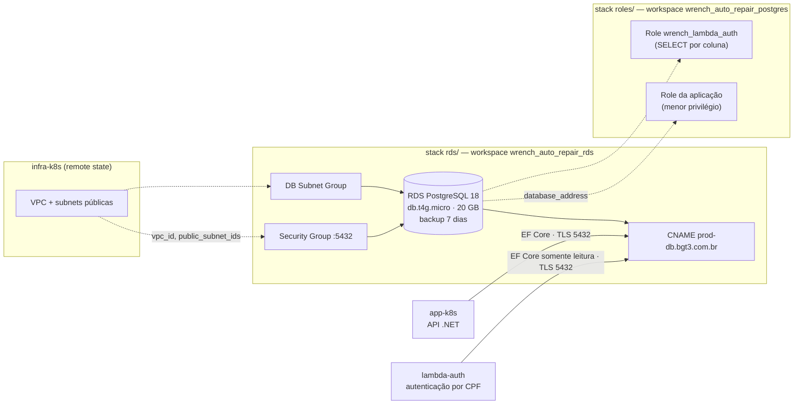

# infra-db — Infraestrutura do Banco de Dados Gerenciado

Terraform que provisiona o **PostgreSQL gerenciado (Amazon RDS)** do Wrench Auto Repair, o role
de menor privilégio que a aplicação usa para se conectar e o role somente leitura da Lambda de
autenticação.

FIAP · Pós-Tech · 15SOAT · Tech Challenge Fase 3 · Grupo **BGT³**

## Propósito

Separar o ciclo de vida do dado do ciclo de vida da plataforma. O cluster EKS pode ser destruído e
recriado sem tocar no banco; o banco pode ser redimensionado sem plano da infraestrutura inteira.

| Repositório | Conteúdo |
|---|---|
| **infra-db** (este) | RDS PostgreSQL e role da aplicação |
| `infra-k8s` | VPC, EKS, ACM, ECR, DNS, SES |
| `app-k8s` | API .NET e chart Helm |
| `lambda-auth` | Function serverless de autenticação e API Gateway |

## Arquitetura



## Por que dois stacks

O provider `postgresql` precisa do endpoint do banco **na configuração do provider**, que o
Terraform resolve antes do `apply`. Um provider não pode depender de um recurso criado no mesmo
plano, então instância e role não cabem no mesmo state:

| Stack | Workspace HCP | Responsabilidade |
|---|---|---|
| `terraform/rds` | `wrench_auto_repair_rds` | Instância RDS, DB subnet group, security group e CNAME |
| `terraform/roles` | `wrench_auto_repair_postgres` | Role da aplicação e role somente leitura da Lambda de autenticação |

O stack `roles/` lê `database_address` e `database_name` do state do `rds/` via
`terraform_remote_state`.

`superuser = false` é obrigatório na configuração do provider: o usuário master do RDS não é um
superusuário PostgreSQL de verdade, e sem essa flag o provider emite comandos que falham.

O stack `roles/` alcança o RDS pelo endpoint público (`publicly_accessible = true` e security group
liberado), porque roda em execução remota no HCP. Não há *default privileges*: a aplicação é Code
First e as tabelas são criadas pelo próprio role da aplicação, que é o dono delas.

## Databases por ambiente

A instância RDS hospeda um database por ambiente, com o mesmo schema:

| Ambiente | Database | Criado por | Dono |
|---|---|---|---|
| `production` | `wrench_auto_repair` | `aws_db_instance` do stack `rds/` | usuário master |
| `homologacao` | `wrench_auto_repair_hml` | `postgresql_database` do stack `roles/` | role da aplicação |

A API de cada ambiente conecta ao seu database e aplica as migrations nele. No database de
homologação o role da aplicação é dono do database e, pelo `pg_database_owner`, do schema
`public`, então cria e altera tabelas sem grants adicionais. No de produção ele recebe `CONNECT`,
`CREATE`, `USAGE` e os privilégios de tabela e sequência concedidos pelo master.

Os outputs `database_production` e `database_homologacao` expõem os dois nomes.

## Role da Lambda de autenticação

A Lambda do repositório `lambda-auth` consulta existência e status do cliente com um role próprio,
`wrench_lambda_auth`, o mesmo nos dois ambientes, que só enxerga as colunas de que precisa:

| Tabela | Colunas com `SELECT` |
|---|---|
| `public."Clientes"` | `Id`, `Documento`, `Email` |
| `public."Usuarios"` | `Id`, `Email`, `PerfilId`, `Ativo` |
| `public."Perfis"` | `Id`, `Nome` |

Senha, telefone, endereço e nome do cliente ficam fora do alcance da function. Essas colunas são o
contrato entre a Lambda e a API; o `app-k8s` tem um teste que falha se uma migration as alterar.

Restrições que definem como os grants são aplicados:

1. **As tabelas precisam existir.** O PostgreSQL só aceita `GRANT` por coluna em tabela existente, e
   as tabelas de cada database são criadas pelo primeiro deploy do `app-k8s` naquele ambiente. Os
   grants de cada database ficam atrás de uma flag própria: `lambda_auth_grants_production` e
   `lambda_auth_grants_homologacao`, falsas por padrão. Cada flag concede `CONNECT`, `USAGE` no schema
   e o `SELECT` por coluna apenas no seu database; desligá-la revoga.
2. **Quem concede.** Os grants de schema e de coluna são aplicados pelo master, que assume
   temporariamente o role dono das tabelas. O `CONNECT` no database de homologação é concedido pelo
   provider `postgresql.aplicacao`, porque só o dono do database pode concedê-lo.

Ordem na primeira subida:

1. `infra-db` com as duas flags em `false` — cria os roles e o database de homologação.
2. `app-k8s` em `develop` e em `master` — as migrations criam as tabelas nos dois databases.
3. Variables `LAMBDA_AUTH_GRANTS_HOMOLOGACAO=true` e `LAMBDA_AUTH_GRANTS_PRODUCTION=true` e nova
   execução deste pipeline — aplica os grants por coluna.
4. `lambda-auth` em `develop` e em `master`.

O orquestrador de provisionamento do `infra-k8s` executa essa sequência e grava as variables.

## Tecnologias

- Terraform >= 1.5 com backend HCP Terraform (organização `bgt3`)
- Providers: AWS ~> 6.0, Cloudflare ~> 5.0, `cyrilgdn/postgresql`
- Amazon RDS PostgreSQL 18
- GitHub Actions

## Como executar

```bash
terraform login

cd terraform/rds
terraform init
terraform apply \
  -var="rds_database_username=<master>" \
  -var="rds_database_password=<senha>"

cd ../roles
terraform init
terraform apply \
  -var="application_database_username=<app>" \
  -var="application_database_password=<senha>" \
  -var="rds_master_username=<master>" \
  -var="rds_master_password=<senha>" \
  -var="lambda_auth_database_password=<senha>" \
  -var="lambda_auth_grants_production=true" \
  -var="lambda_auth_grants_homologacao=true"
```

## Deploy

| Gatilho | O que acontece |
|---|---|
| Pull request para `master` | `fmt -check`, `init` e `validate` dos dois stacks |
| Push em `master` | `apply` do `rds/` e, em seguida, do `roles/` |
| `workflow_dispatch` em `ci-cd.yml` | Mesmo fluxo, sob demanda |
| `workflow_dispatch` em `destroy.yml` com `confirmacao=DESTRUIR` | Destroy do `roles/` e, em seguida, do `rds/` |

O `roles/` depende do `rds/` no mesmo workflow (`needs`), garantindo que a instância exista antes
da tentativa de conexão.

### Variáveis e secrets

| Nome | Tipo | Descrição |
|---|---|---|
| `TF_API_TOKEN` | secret | Token do HCP Terraform |
| `RDS_MASTER_USERNAME` / `RDS_MASTER_PASSWORD` | secret | Usuário master do RDS |
| `APPLICATION_DATABASE_USERNAME` / `APPLICATION_DB_PASSWORD` | secret | Role de menor privilégio da aplicação |
| `LAMBDA_AUTH_DB_USERNAME` / `LAMBDA_AUTH_DB_PASSWORD` | secret | Role somente leitura da Lambda de autenticação; os mesmos valores vão para o `lambda-auth` |
| `LAMBDA_AUTH_GRANTS_PRODUCTION` | variable | `true` depois do primeiro deploy do `app-k8s` em `master`; grants da Lambda no database de produção |
| `LAMBDA_AUTH_GRANTS_HOMOLOGACAO` | variable | `true` depois do primeiro deploy do `app-k8s` em `develop`; grants da Lambda no database de homologação |
| `CLOUDFLARE_API_TOKEN` / `CLOUDFLARE_ZONE_ID` | secret | CNAME `prod-db` |

## Destruição

O workflow **Destruir Banco de Dados** (`destroy.yml`) só executa com a entrada `confirmacao`
igual a `DESTRUIR`. É chamado pelo orquestrador de destruição do `infra-k8s` depois da Lambda e da
aplicação, e antes da infraestrutura Kubernetes, porque o `rds/` usa a VPC do `infra-k8s`.

1. `roles/` — remove grants, roles e o database de homologação.
2. `rds/` — remove a instância, o subnet group, o security group e o CNAME `prod-db`. A instância é
   destruída sem snapshot final (`skip_final_snapshot = true`).

Restrições:

* Stack sem recursos no state é tratado como já destruído; a execução é idempotente.
* Se o destroy do `roles/` falhar — por exemplo, com a instância já inacessível —, os recursos do
  PostgreSQL são removidos do state e o pipeline segue para o `rds/`, que elimina tudo o que existia
  dentro da instância. O resumo da execução lista o que foi removido do state.

## Migração de state vinda do monorepo

Na Fase 2 o `aws_db_instance.wrench_db`, o `aws_db_subnet_group.rds`, o
`aws_security_group.allow_postgres_traffic` e o `cloudflare_dns_record.db` viviam no state
`wrench_auto_repair` (repositório `infra-k8s`). Este repositório passou a declará-los.

**Situação verificada em 2026-09-02:** o state do `infra-k8s` não contém nenhum recurso de banco —
o RDS foi destruído ao fim da Fase 2. Não há state a migrar. O workspace
`wrench_auto_repair_rds` já foi criado no projeto *Wrench Auto Repair* e o compartilhamento de
state está ativo no nível do projeto.

Faltam duas coisas antes do primeiro `apply`: definir as variáveis sensíveis no workspace e
reconciliar o state residual do `wrench_auto_repair_postgres`, que ainda descreve o role de um
banco que não existe mais. Ambas estão detalhadas em
[`docs/migracao-de-state.md`](./docs/migracao-de-state.md), junto com o procedimento completo caso
a separação precise ser refeita com uma instância viva.
